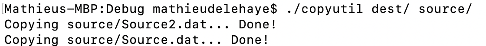

# copyutility
A utility in C++17 with filesystem library and STL to copy files and directories.  

The following features are avaialble:
- Copy directory to a directory
- Copy file to file
- Copy file to a directory.

<kbd></kbd>
